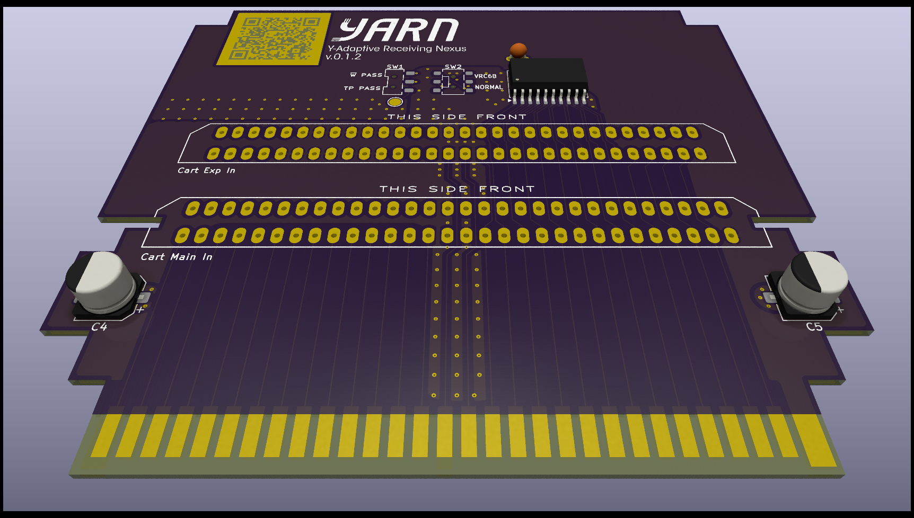

# Y.A.R.N. Expansion Audio Interfacer

An Open-Source HardWare (OSHW) Famicom single expansion audio interfacer.

This project aims to allow a host cartridge to control an expansion audio cartridge's sound chip through selected audio registers. This is a child of the S.C.A.R.F. project.

## PCB Specifications

- 2 layer PCB
- 1.2mm thickness
- ENIG-RoHS surface finish recommended; Gold fingers optional
- Beveled edge, chamfer cut
- Any soldermask color you want!

## License

- The PCB and schematics are licensed under the TAPR Open Hardware License ([www.tapr.org/OHL](http://www.tapr.org/OHL)).
- The S.C.A.R.F. Expansion Audio Interfacer Address Decoder ROM source code file is licensed under [MIT](https://mit-license.org/)
- © Persune 2022

## Credits

- lidnariq, grievre, Iyatemu, and plgDavid - advice, suggestions, general help
- lidnariq - providing advice for my schematics and addressing logic
- grievre - providing advice for my PCB design
- Special thanks to the NESDEV community, this project wouldn't have been possible without their extensive information and wiki!

## Support

If you enjoy this project or find it helpful, please support me on [Ko-Fi](https://ko-fi.com/persune) or [Patreon](https://www.patreon.com/persune)!

